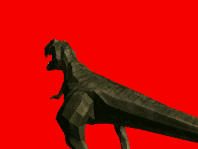
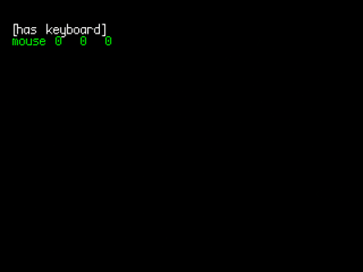
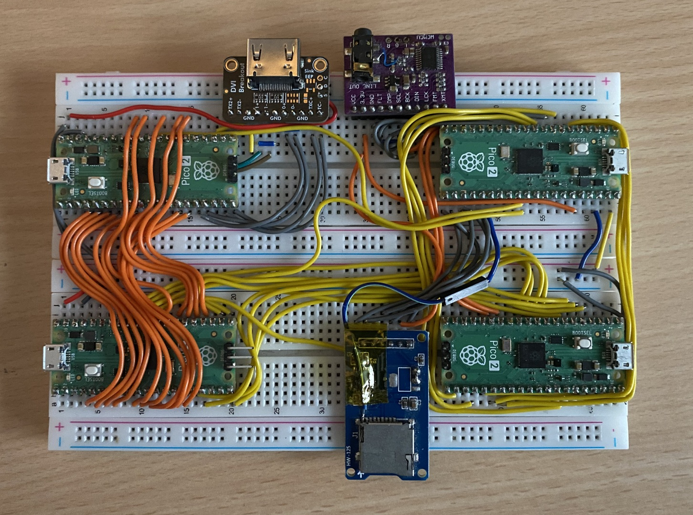

# Picocom16
A DIY breadboard computer based on four RP2350 micro controllers that can be built without any soldering.


## Features
Easy build with no soldering.

Fast debugging using VSCode and a usb cable.

Double buffered frame buffer with simple gpu for drawing.

Async DMA bus distributes graphics and sound to each core.

Written in C with a clear and simple api.

## Display

Frame buffer: 320×224, 16 bit color palette, 60 Hz.    

GPU Method: Command dispatch and Tiling.

Blend modes:  4bit alpha composite, Additive blending.

## Memory

System RAM: 512 KB SRAM

VRAM: 512 KB SRAM

FB: 512 KB SRAM

Audio RAM: 512 KB SRAM

## DMA
VDP1 Bus - System to VDP gpu command stream async.

VDP2 Bus - VDP1 to VDP2 tile stream.

APU Bus - System to APU audio commands, audio streams, HID inputs and SD Card IO.


## Storage
Physics format: Format: SD memory card.

File System: Fat32.

## Audio
DSP mixer: play, pause, pan & frequency.

Audio formats: Raw PCM 16, OGG vorbis.

Streaming: Audio stream buffer for seamless audio looping and streaming from System core.

Rate: 11 Khz.

Output: Stereo output via 3mm jack.

Channels: 32 channels ( sfx or ogg in any combination ).

## Cores
APU - Dedicated audio processor. [ [src](sw/apu) ] [ [uf2](firmware/apu.uf2) ]

System - Game processor for game logic, building graphics and audio commands.  [ [demos](sw/demos) ] 

VDP1 - Graphics tile generator.  [ [src](sw/vdp1) ] [ [uf2](firmware/vdp1.uf2) ]

VDP2 - Tile compositor and DVI output.  [ [src](sw/vdp2) ] [ [uf2](firmware/vdp2.uf2) ]

## Examples

gfx_demo [ [src](sw/demos/gfx_demo) ] [ [uf2](firmware/gfx_demo.uf2) ]



input_demo  [ [src](sw/demos/gfx_demo) ] [ [uf2](firmware/gfx_demo.uf2) ]



minerload   [ [demo](https://picocom16.itch.io/minerload) ] [ [uf2](firmware/minerload.uf2) ]


## Components BOM

All components can be source from amazon or other suppliers.

    1 x Breadboard kit - SUNFOUNDER 5PCS Breadboards Kit Include 3PCS 830 Point 2PCS 400 Point Solderless Breadboard Compatible with Arduino Proto Shield Distribution Connecting Blocks 

    1 x Wire kit - 560 Pcs Jumper Wire Kit, 14 Lengths Assorted Preformed Breadboard Jumper Wires, Male to Male Solderless Jumper Cables with Storage Box for Prototyping, LED Strips, and Test Circuits 

    4 x Pre-Soldered Raspberry Pi Pico 2 with Header RP2350 Microcontroller Board Mini Board Kit Based on RP2350 Chip,Dual-core & Dual-architecture,Support C/C++/Python 

    1 x PCM5102 DAC Decoder Module I2S Interface GY-PCM5102 PHAT Format Player Board Digital-to-Analog Converter Voice Module for Arduino, Raspberry Pi with 3.5mm Jack Audio Cable, Dupont Cable 

    1 x AZDelivery Micro SD SPI Storage Board TF Memory Card Adapter Shield Module 5V compatible with Arduino Including E-Book! (Pack of 3) 

    1 x Adafruit DVI Breakout Board - For HDMI Source Devices 

    1 x 18pcs USB to DIP Breakout Adapter Converter Mini 5p USB/2.54 mm 4p/USB 2.0 4p/USB 3.0 Flat/Micro USB Type B/USB Type-B Square PCB Power Breakout Board Module

## Build guide
This is what the fully assembled breadboard looks like:



See [docs/guides/picocom16-breadboard/Build-guide.md](docs/guides/picocom16-breadboard/Build-guide.md)


## System dependencies

VSCode: https://code.visualstudio.com/

Pico sdk: https://marketplace.visualstudio.com/items?itemName=raspberry-pi.raspberry-pi-pico

Asset tooling python deps
```
pip install bdfparser
```