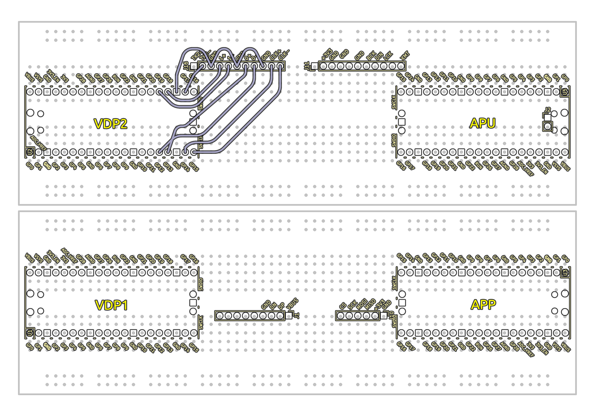
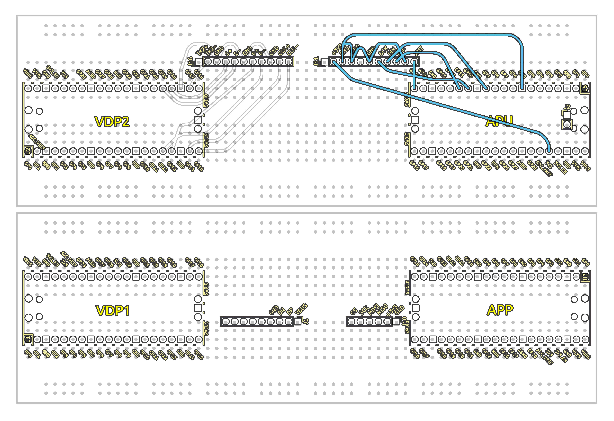
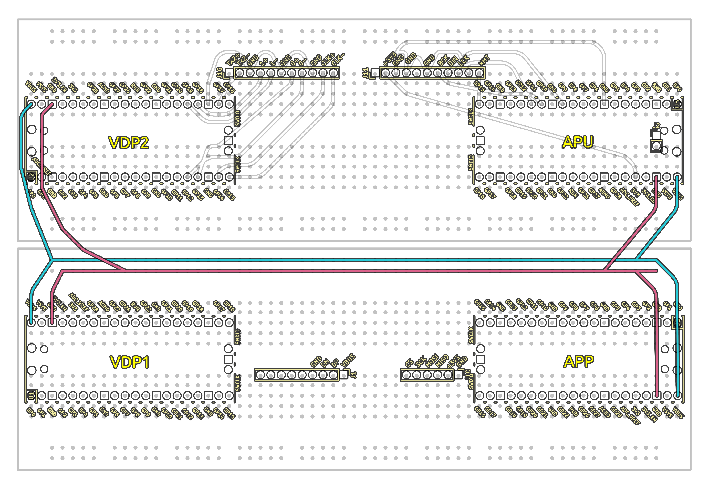
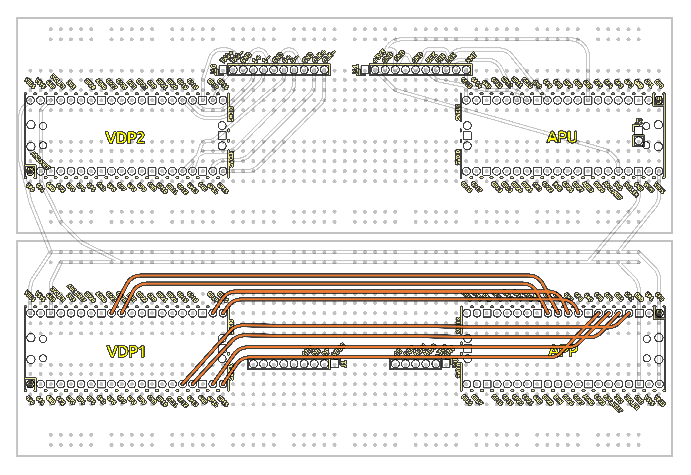
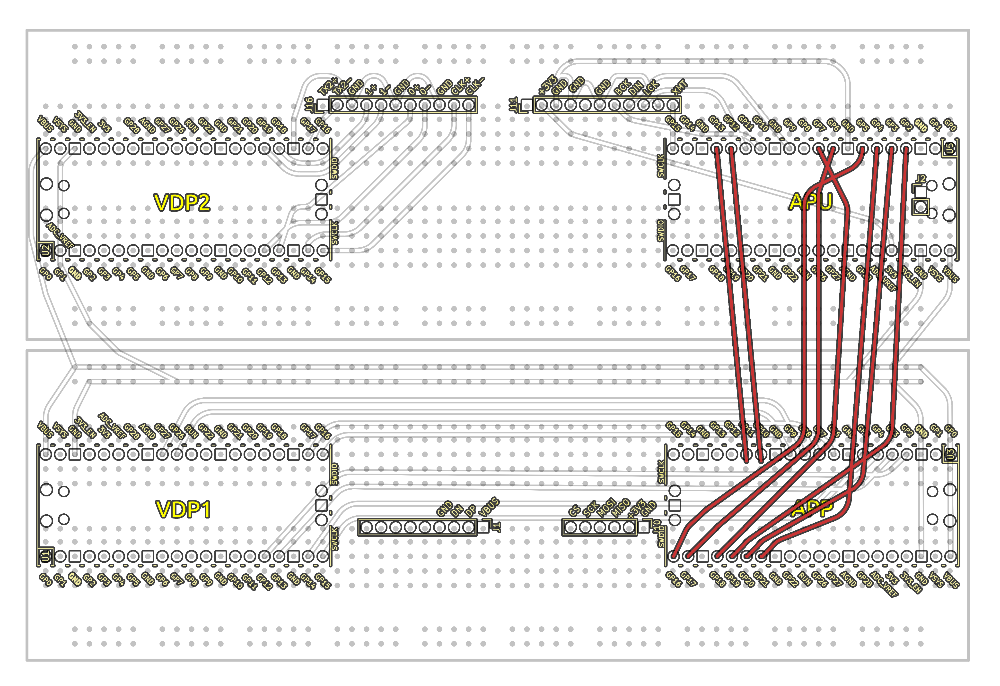
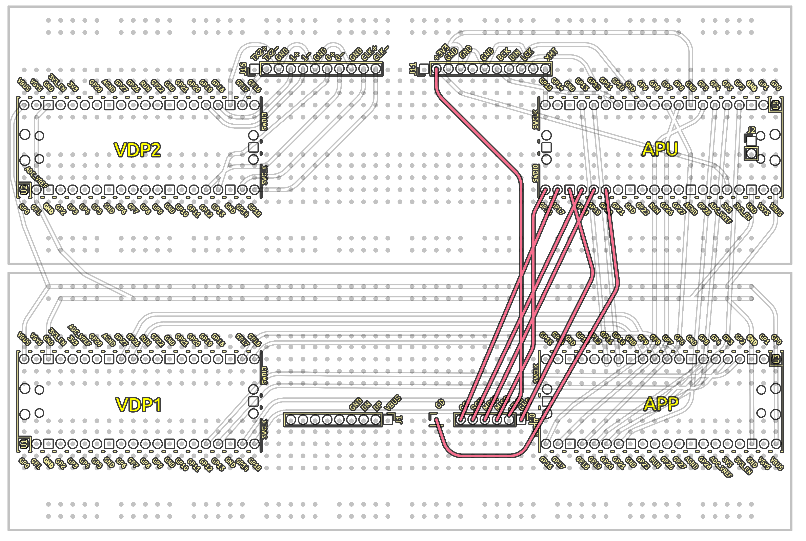
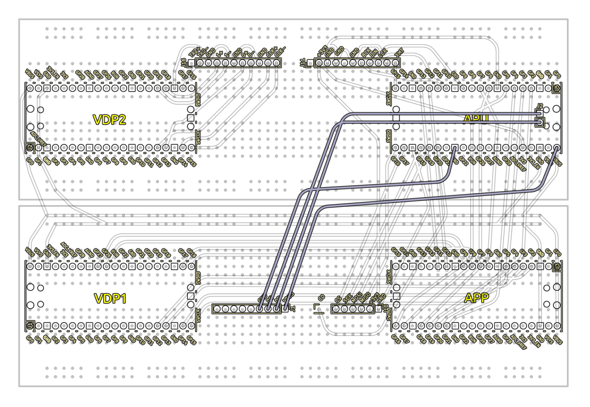
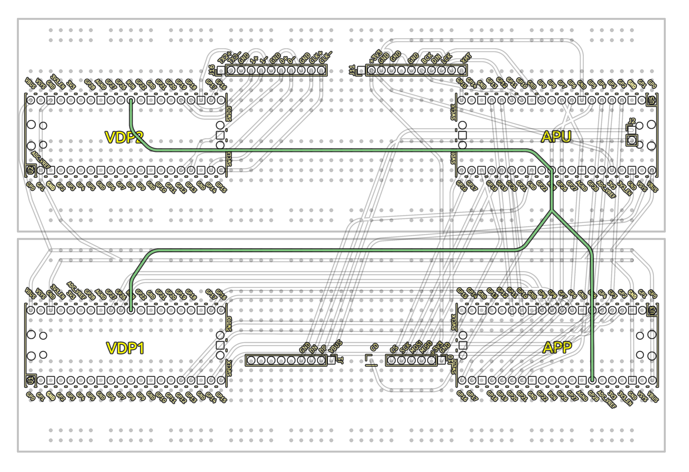
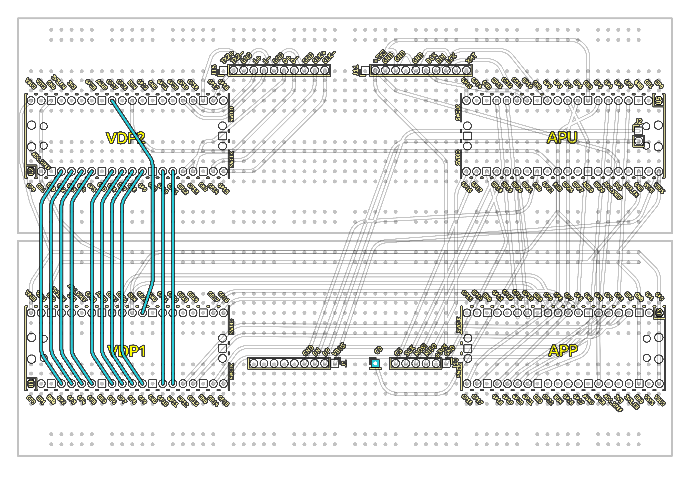

# Picocom16 Breadboard build guide

## Intro
The picocom 16 breadboard console is an easy to build fully featured computer.

## BOM
    1 x Breadboard kit - SUNFOUNDER 5PCS Breadboards Kit Include 3PCS 830 Point 2PCS 400 Point Solderless Breadboard Compatible with Arduino Proto Shield Distribution Connecting Blocks 

    1 x Wire kit - 560 Pcs Jumper Wire Kit, 14 Lengths Assorted Preformed Breadboard Jumper Wires, Male to Male Solderless Jumper Cables with Storage Box for Prototyping, LED Strips, and Test Circuits 

    4 x Pre-Soldered Raspberry Pi Pico 2 with Header RP2350 Microcontroller Board Mini Board Kit Based on RP2350 Chip,Dual-core & Dual-architecture,Support C/C++/Python 

    1 x PCM5102 DAC Decoder Module I2S Interface GY-PCM5102 PHAT Format Player Board Digital-to-Analog Converter Voice Module for Arduino, Raspberry Pi with 3.5mm Jack Audio Cable, Dupont Cable 

    1 x AZDelivery Micro SD SPI Storage Board TF Memory Card Adapter Shield Module 5V compatible with Arduino Including E-Book! (Pack of 3) 

    1 x Adafruit DVI Breakout Board - For HDMI Source Devices 

    1 x 18pcs USB to DIP Breakout Adapter Converter Mini 5p USB/2.54 mm 4p/USB 2.0 4p/USB 3.0 Flat/Micro USB Type B/USB Type-B Square PCB Power Breakout Board Module

## Workflow
Copy the wiring diagrams in each section or open the Kicad project and following the wires from the schematic or pcb view.

At keys stages UF2 images are provided to test for certain features eg. does the audio output. To flash these images to specific chips plug a usb cable while holding the bootsel button then copy the image onto the RP2350 drive mount.

## Step 1 - HDMI

- Complete wiring diagram.
- Flash /firmware/vdp2.uf2 to the "VDP2" chip.
- The screen should go blue then after a few seconds a Red, Green, Blue vertical strip pattern should appear. If some colors are missing or the wrong order then double check the wiring. If no signal is detected then the display might not be compatible, some TV's require the 5V supply to be attached which requires soldering which is outside the scope of this guide.

## Step 2 - DAC

- Follow the DAC wiring diagram. 
- Flash /firmware/vdp2.uf2 to the "APU" chip.
- Plug a set of headphones or speakers into the mini jack port on the DAC module.
- After 2 seconds a chime should be heard, if nothing plays then check the wiring.

## Step 3 - PWR

- Follow the power wiring diagram. 

Note: Once wired, all pico the boards will startup. If you have multiple USB cables connected (an isolated usb is recommended for this) the bootsel will not work until all cables have been disconnected

## Step 4 - VLNK
- Follow the VLNK wiring diagram. 


To validate the VLNK bus is wired correctly do the following steps to flash a temporary test firmware:
- Disconnect all usb / power cables and connect a single USB cable to the target board when flashing.
- Flash "step-4-VLNK/bustester_a.uf2" onto APP pico.
- Flash "step-4-VLNK/bustester_b.uf2" onto VDP1 pico.
- LEDs on both devices should go solid after 5.
- If no LEDs light up then attach a usb cable and connect to the vdp1 and/or app pico serial port (via putty or picocom ) see the diagnostic output eg.
```
[APP->VDP1 test] summary
        input[0] gpio: 5 holdSamples: 1248, state: 0, cycles: 2
        input[1] gpio: 6 holdSamples: 1248, state: 0, cycles: 2
        input[2] gpio: 7 holdSamples: 1248, state: 0, cycles: 0
```
for example input[2] appears to be disconnected, check the data-sheet and re-check the wiring to resolve.

## Step 5 - ALNK

- Follow the ALNK wiring diagram. 
To validate the VLNK bus is wired correctly do the following steps to flash a temporary test firmware:

- Flash "Step-5-ALNK/bustester_a.uf2" onto APP pico.
- Flash "Step-5-ALNK/bustester_b.uf2" onto VDP1 pico.
- LEDs on both devices (APP and APU) should go solid after 5.
- Example output from the console on the APP device (if connected)
```
[APU->APP test] summary
        input[0] gpio: 2 holdSamples: 1, state: 1, cycles: 31
        input[1] gpio: 3 holdSamples: 19, state: 0, cycles: 30
        input[2] gpio: 4 holdSamples: 9, state: 0, cycles: 30
        txAckPin[ACK] gpio: 13 holdSamples: 1, state: 1, cycles: 46
```        

## Step 6 - SDCARD

- Follow the SDCARD wiring diagram. 

An extra wire was soldered to the SD Card module to bring out the card detect pin, some modules have this but may require soldering an extra wire. This can be disabled in the APU firmware ( sw/apu/src/hw_config.c ) if not used.

## Step 7 - FUSB (Optional)

- Follow the FUSB wiring diagram. 
NOTE: A Micro USB OTG Hub Adapter can be plugged into the APU for USB functionality, this allows plugging in multiple devices instead of the limited FUSB port.


## Step 8 - RESET

- Follow the RESET wiring diagram. 


## Step 9 - VDBUS

- Follow the VDBUS wiring diagram. 

## Step 10 - XLNK

- Follow the XLNK wiring diagram. 

- Flash "Step-10-XLNK/bustester_a.uf2" onto VDP1 pico.
- Flash "Step-10-XLNK/bustester_b.uf2" onto VDP2 pico.
- LEDs on both devices (APP and APU) should go solid after 5.

## Step 11 - Display testing
Thats it, all components are wired and the wiring has been validated. To put the VDP through it paces an test program will send commands to VDP1 then to VDP2 to test the video output of the console.

- Flash "firmware/vdp2.uf2" onto the VDP2 pico.
- Flash "firmware/vdp1.uf2" onto the VDP1 pico.
- Flash "firmware/apu.uf2" onto the APU pico.
- Flash "firmware/gfx_demo.uf2" onto the APP pico.

